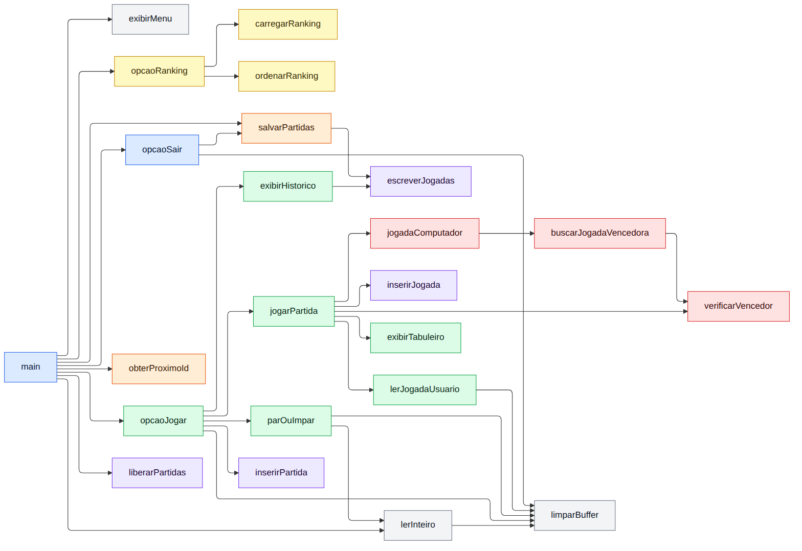

# Jogo da Velha em C

Jogo da Velha do usuário contra o computador, feito em C, que guarda o histórico de partidas e jogadas em **listas encadeadas**, grava as partidas em arquivo texto e monta um ranking de vitórias.

Trabalho prático da disciplina Estrutura de Dados I, do curso de Tecnologia em Análise e Desenvolvimento de Sistemas da UFPR (2026).

## Funcionalidades

O programa abre com um menu de quatro opções:

| Opção | O que faz |
|---|---|
| **1) Jogar** | Partidas ilimitadas contra o computador. O par ou ímpar decide quem começa a primeira (quem começa joga com X) e o início alterna nas seguintes. Ao sair, mostra o histórico de cada partida e o vencedor geral |
| **2) Salvar** | Grava as partidas ainda não salvas no arquivo `partidas_velha.txt`, em modo append |
| **3) Ranquear** | Lê o arquivo, soma as vitórias de cada jogador e exibe o ranking em ordem decrescente |
| **4) Sair** | Se houver partidas não salvas, pergunta se deve salvá-las antes de encerrar |

## Como compilar e executar

É preciso um compilador C (`gcc` ou `clang`).

```
gcc -std=c99 -Wall -Wextra jogo_velha.c -o velha
./velha
```

No Windows, o executável é `velha.exe`.

## Como jogar

As jogadas são digitadas no formato `linha-coluna`, com valores de 1 a 3. Por exemplo, `1-3` é a primeira linha, terceira coluna.

```
O computador jogou: 1-3
      1   2   3
   1  O |   | X 
     ---+---+---
   2    | X |   
     ---+---+---
   3    |   |   
Sua jogada (linha-coluna, ex.: 1-2):
```

Ao sair da opção 1, o programa mostra o histórico. Em caso de vitória aparecem as jogadas do vencedor; em caso de empate, as jogadas dos dois:

```
===== HISTORICO DE PARTIDAS =====

Partida 1
Vencedor: Computador
Jogadas: 2-2;1-3;3-1;

Partida 2
Vencedor: Vitor
Jogadas: 1-1;3-3;3-1;3-2;

Partida 3
Resultado: EMPATE
Vitor: 1-1;3-1;2-3;1-2;
Computador: 2-2;1-3;2-1;3-3;3-2;

=== PLACAR ===
Vitor: 1 vitoria(s)
Computador: 1 vitoria(s)
Empates: 1
Empate no conjunto de partidas!
```

## Estruturas de dados

O histórico fica na memória em listas simplesmente encadeadas, com inserção no fim para preservar a ordem dos acontecimentos.

| Struct | Papel | Campos |
|---|---|---|
| `Jogada` | Nó da lista de jogadas | `linha`, `coluna`, `prox` |
| `Partida` | Nó da lista de partidas | `id`, `nomeUsuario`, `nomeComputador`, `jogadasUsuario`, `jogadasComputador`, `resultado`, `salva`, `prox` |
| `Jogador` | Elemento do vetor do ranking | `nome`, `vitorias` |

Existe uma lista de partidas, e cada partida carrega duas listas de jogadas: a do usuário e a do computador.

```
partidas
   │
   ▼
[Partida 1] ── prox ──► [Partida 2] ── prox ──► NULL
   │ jogadasUsuario ────► 1-1 ─► 3-3 ─► 3-1 ─► 3-2 ─► NULL
   │ jogadasComputador ─► 2-2 ─► 1-3 ─► 2-1 ─► NULL
```

O programa não usa variáveis globais: a lista de partidas, o nome do usuário e o próximo ID são variáveis locais da `main`, passadas por parâmetro.

## Algoritmo do computador

O computador usa uma estratégia por regras de prioridade. Na sua vez, testa as regras nesta ordem e faz a jogada da primeira que servir:

1. **Ganhar:** se existe uma casa que completa três símbolos dele, joga nela.
2. **Bloquear:** se existe uma casa que daria a vitória ao usuário na próxima jogada, joga nela.
3. **Centro:** se a casa do meio está livre, joga nela.
4. **Canto:** joga no primeiro canto livre.
5. **Lateral:** joga na primeira casa livre que sobrar.

Para descobrir onde ganhar e onde bloquear, ele experimenta um símbolo em cada casa livre, verifica se isso fecha três em linha e desfaz a experiência. Não há recursão: o computador olha apenas uma jogada à frente.

É uma versão reduzida da estratégia do programa de Jogo da Velha de Newell e Simon (1972), que usa oito regras; aqui são usadas cinco. Por não tratar ameaças duplas, o algoritmo não é imbatível: o usuário consegue vencer quando começa a partida e cria duas ameaças ao mesmo tempo.

## Formato do arquivo

Cada partida ocupa uma linha de `partidas_velha.txt`, com os campos separados por ponto e vírgula:

```
ID;nome_usuario;jogadas do usuário;nome_computador;jogadas do computador;resultado
```

O resultado é o nome do vencedor ou `EMPATE`. Exemplo:

```
1;Vitor;1-1;1-2;Computador;2-2;1-3;3-1;Computador
2;Vitor;1-1;3-3;3-1;3-2;Computador;2-2;1-3;2-1;Vitor
3;Vitor;1-1;3-1;2-3;1-2;Computador;2-2;1-3;2-1;3-3;3-2;EMPATE
```

O ID é único: ao iniciar, o programa lê o maior ID já gravado e continua a numeração a partir dele.

## Diagrama de funções

O programa tem 23 funções. O diagrama mostra quem chama quem.



| Cor | Grupo | Funções |
|---|---|---|
| Azul | Menu e saída | `main`, `opcaoSair` |
| Verde | Partida | `opcaoJogar`, `parOuImpar`, `jogarPartida`, `exibirTabuleiro`, `lerJogadaUsuario`, `exibirHistorico` |
| Vermelho | Algoritmo do computador | `jogadaComputador`, `buscarJogadaVencedora`, `verificarVencedor` |
| Roxo | Listas encadeadas | `inserirJogada`, `escreverJogadas`, `inserirPartida`, `liberarPartidas` |
| Laranja | Arquivo | `obterProximoId`, `salvarPartidas` |
| Amarelo | Ranking | `opcaoRanking`, `carregarRanking`, `ordenarRanking` |
| Cinza | Apoio | `exibirMenu`, `lerInteiro`, `limparBuffer` |

### O que cada função faz

**Menu e saída**

| Função | Descrição |
|---|---|
| `main` | Guarda o estado da sessão e executa o laço do menu |
| `opcaoSair` | Conta as partidas não salvas e pergunta se deve salvá-las |

**Partida**

| Função | Descrição |
|---|---|
| `opcaoJogar` | Pede o nome, faz o par ou ímpar e repete partidas até o usuário parar |
| `parOuImpar` | Decide quem começa a primeira partida |
| `jogarPartida` | Executa uma partida inteira e devolve o nó preenchido |
| `exibirTabuleiro` | Desenha o tabuleiro na tela |
| `lerJogadaUsuario` | Lê e valida a jogada do usuário |
| `exibirHistorico` | Mostra todas as partidas, o placar e o vencedor geral |

**Algoritmo do computador**

| Função | Descrição |
|---|---|
| `jogadaComputador` | Aplica as cinco regras e escolhe a casa |
| `buscarJogadaVencedora` | Procura uma casa em que um símbolo vence na hora |
| `verificarVencedor` | Confere linhas, colunas e diagonais |

**Listas encadeadas**

| Função | Descrição |
|---|---|
| `inserirJogada` | Aloca um nó e o insere no fim da lista de jogadas |
| `escreverJogadas` | Percorre a lista e escreve as jogadas na tela ou no arquivo |
| `inserirPartida` | Insere uma partida no fim da lista de partidas |
| `liberarPartidas` | Libera toda a memória alocada |

**Arquivo**

| Função | Descrição |
|---|---|
| `obterProximoId` | Lê o maior ID do arquivo e devolve o seguinte |
| `salvarPartidas` | Grava em append as partidas ainda não salvas |

**Ranking**

| Função | Descrição |
|---|---|
| `opcaoRanking` | Carrega, ordena e exibe o ranking |
| `carregarRanking` | Lê o arquivo e soma as vitórias por jogador |
| `ordenarRanking` | Ordena pelo método da bolha, em ordem decrescente |

**Apoio**

| Função | Descrição |
|---|---|
| `exibirMenu` | Imprime as opções do menu |
| `lerInteiro` | Lê um número inteiro e sinaliza entrada inválida |
| `limparBuffer` | Descarta o restante da linha digitada |

## Limitações conhecidas

- O computador não é imbatível (ver a seção do algoritmo).
- O nome do usuário não é validado: um `;` no nome quebra o formato do arquivo.
- O ranking comporta até 100 jogadores diferentes.
- O programa não trata o fim da entrada (Ctrl+D ou Ctrl+Z); nesse caso, encerre com Ctrl+C.

## Autores

- Vitor Savi do Nascimento
- Felipe Fernandes de Azevedo

## Referências

- WIKIPEDIA. *Tic-tac-toe*. Seção "Strategy". Disponível em: <https://en.wikipedia.org/wiki/Tic-tac-toe>.
- WIKIPÉDIA. *Jogo da velha*. Disponível em: <https://pt.wikipedia.org/wiki/Jogo_da_velha>.
- CROWLEY, Kevin; SIEGLER, Robert S. Flexible Strategy Use in Young Children's Tic-Tac-Toe. *Cognitive Science*, v. 17, n. 4, p. 531–561, 1993.