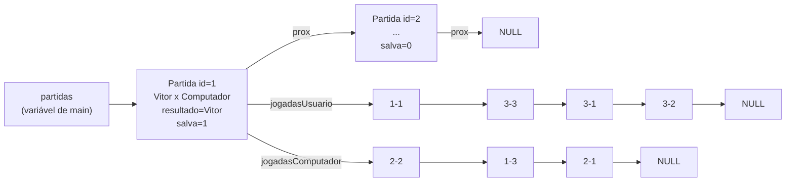
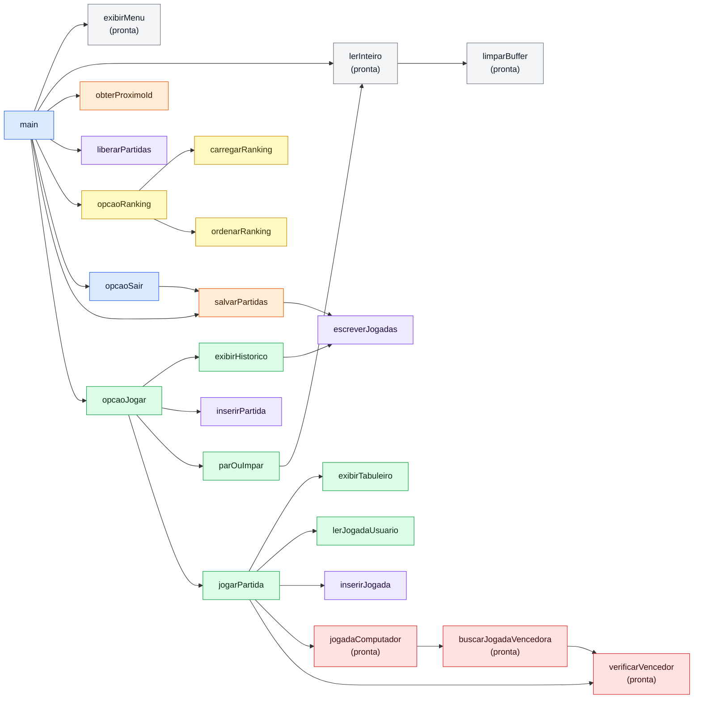

# Arquitetura do programa: Jogo da Velha com listas encadeadas (C)

**Versão simples: 23 funções e 3 structs.**

Este documento é o "mapa" do trabalho: todas as estruturas, todas as funções, os parâmetros e as variáveis locais de cada uma, e quem chama quem. O código das funções que vocês vão escrever não está aqui; o passo a passo de cada uma está nos comentários do `jogo_velha.c`.

Das 23 funções, **7 já vêm prontas** no `jogo_velha.c` (o algoritmo do computador, três funções de apoio e a `main`) e **16 são para a dupla implementar**.

A arquitetura foi validada com uma implementação de teste completa (não entregue): compilou sem avisos com `gcc` e `clang`, jogou partidas com vitória do usuário, vitória do computador e empate, salvou, gerou o ranking e passou no `valgrind` sem vazamento de memória.

---

## 1. Regras de projeto que guiam tudo

- **Sem variáveis globais.** O que precisa sobreviver entre as opções do menu nasce em `main` e é passado por parâmetro.
- **Constantes com `#define`** não são variáveis globais, então podem ser usadas à vontade.
- **Listas encadeadas onde o enunciado pede:** jogadas do usuário, jogadas do computador e partidas da sessão. O ranking usa um vetor comum, porque o enunciado não exige lista ali.
- **Lista = um ponteiro para o primeiro nó.** `NULL` significa lista vazia. Não há struct "descritor" com início, fim e quantidade.
- **Funções que inserem em lista devolvem o início da lista.** Assim não é preciso ponteiro para ponteiro. Quem chama guarda o retorno: `lista = inserir(lista, ...)`.
- **Depois de todo `scanf`, `limparBuffer()`.** Ver seção 9.

---

## 2. Constantes (`#define`)

| Constante | Valor | Uso |
|---|---|---|
| `TAM_NOME` | `50` | Tamanho dos vetores de nome e de resultado |
| `TAM_LINHA` | `1024` | Tamanho do buffer de leitura de uma linha do arquivo |
| `MAX_JOGADORES` | `100` | Tamanho do vetor do ranking |
| `ARQUIVO_PARTIDAS` | `"partidas_velha.txt"` | Nome do arquivo exigido pela especificação |
| `NOME_COMPUTADOR` | `"Computador"` | Nome do jogador computador |
| `TEXTO_EMPATE` | `"EMPATE"` | String gravada no campo resultado quando empata |
| `VAZIO` | `' '` | Conteúdo de uma casa livre do tabuleiro |

---

## 3. Estruturas de dados

### 3.1 Campos de cada `struct`

**`Jogada`** (nó da lista encadeada de jogadas)

| Campo | Tipo | Significado |
|---|---|---|
| `linha` | `int` | Linha da jogada, **1 a 3** |
| `coluna` | `int` | Coluna da jogada, **1 a 3** |
| `prox` | `struct Jogada *` | Próxima jogada, ou `NULL` se for a última |

**`Partida`** (nó da lista encadeada de partidas)

| Campo | Tipo | Significado |
|---|---|---|
| `id` | `int` | ID único numérico |
| `nomeUsuario` | `char[TAM_NOME]` | Nome do jogador usuário |
| `nomeComputador` | `char[TAM_NOME]` | Nome do jogador computador |
| `jogadasUsuario` | `Jogada *` | Primeiro nó da **lista encadeada** de jogadas do usuário |
| `jogadasComputador` | `Jogada *` | Primeiro nó da **lista encadeada** de jogadas do computador |
| `resultado` | `char[TAM_NOME]` | Nome do vencedor ou `TEXTO_EMPATE` |
| `salva` | `int` | 0 = ainda não foi para o arquivo, 1 = já foi (evita gravar duas vezes) |
| `prox` | `struct Partida *` | Próxima partida, ou `NULL` se for a última |

**`Jogador`** (um elemento do vetor do ranking; não é lista)

| Campo | Tipo | Significado |
|---|---|---|
| `nome` | `char[TAM_NOME]` | Nome do jogador |
| `vitorias` | `int` | Total de vitórias apuradas no arquivo |

### 3.2 Como as listas ficam na memória



Versão texto (caso o visualizador de Markdown não desenhe Mermaid):

```
partidas (ponteiro, em main)
   │
   ▼
[Partida 1] ── prox ──► [Partida 2] ── prox ──► NULL
   │ jogadasUsuario ────► 1-1 ─► 3-3 ─► 3-1 ─► 3-2 ─► NULL
   │ jogadasComputador ─► 2-2 ─► 1-3 ─► 2-1 ─► NULL
```

---

## 4. Diagrama de chamadas

A mesma figura vai junto em `diagrama_funcoes.png`, com as setas mais bem distribuídas. Se o desenho abaixo aparecer com setas passando por cima de caixas, usem o PNG.



Cores: azul = `main` e saída, verde = partida, vermelho = algoritmo do computador, roxo = listas encadeadas, laranja = arquivo, amarelo = ranking, cinza = apoio. As funções marcadas "(pronta)" e a `main` já vêm implementadas.

`limparBuffer` também é chamada por `parOuImpar`, `lerJogadaUsuario`, `opcaoJogar` e `opcaoSair` (depois de cada `scanf`); essas setas ficaram fora do desenho para não poluir.

Versão texto:

```
main (pronta)
├── obterProximoId
├── [laço do menu]
│   ├── exibirMenu (pronta)
│   ├── lerInteiro (pronta) ── limparBuffer (pronta)
│   ├── 1 → opcaoJogar
│   │       ├── parOuImpar ── lerInteiro
│   │       ├── [laço de partidas]
│   │       │   ├── jogarPartida
│   │       │   │   └── [laço de jogadas]
│   │       │   │       ├── exibirTabuleiro
│   │       │   │       ├── lerJogadaUsuario                    (vez do usuário)
│   │       │   │       ├── jogadaComputador (pronta)           (vez do computador)
│   │       │   │       │     └── buscarJogadaVencedora (pronta)
│   │       │   │       │           └── verificarVencedor (pronta)
│   │       │   │       ├── inserirJogada
│   │       │   │       └── verificarVencedor (pronta)
│   │       │   └── inserirPartida
│   │       └── exibirHistorico ── escreverJogadas
│   ├── 2 → salvarPartidas ── escreverJogadas
│   ├── 3 → opcaoRanking
│   │       ├── carregarRanking
│   │       └── ordenarRanking
│   └── 4 → opcaoSair ── salvarPartidas
└── liberarPartidas
```

---

## 5. Funções, parâmetros e variáveis

Legenda das colunas:
- **Parâmetros:** o que a função recebe. `*` indica ponteiro.
- **Variáveis locais:** o que deve ser declarado dentro da função.
- **Retorno:** o que a função devolve.

### 5.1 Algoritmo do computador (prontas)

Explicação completa em `algoritmo_computador.md` e `explicacao_algoritmo_e_main.md`.

| Função | Parâmetros | Variáveis locais | Retorno | O que faz |
|---|---|---|---|---|
| `verificarVencedor` | `char tabuleiro[3][3]` | `int i` | `char` (`'X'`, `'O'` ou `VAZIO`) | Checa 3 linhas, 3 colunas e 2 diagonais |
| `buscarJogadaVencedora` | `char tabuleiro[3][3]`, `char simbolo`, `int *linha`, `int *coluna` | `int i`, `int j`, `int venceu` | `int` (1 achou, 0 não) | Procura uma casa livre em que `simbolo` vence na hora; devolve a casa em `*linha`, `*coluna` (0 a 2) |
| `jogadaComputador` | `char tabuleiro[3][3]`, `char simboloComputador`, `char simboloUsuario`, `int *linha`, `int *coluna` | `int cantoLinha[4]`, `int cantoColuna[4]`, `int i`, `int j`, `int k` | `void` (resposta em `*linha`, `*coluna`, 0 a 2) | Aplica as 5 regras em ordem: ganhar, bloquear, centro, canto, lateral |

### 5.2 Apoio (prontas)

| Função | Parâmetros | Variáveis locais | Retorno | O que faz |
|---|---|---|---|---|
| `limparBuffer` | — | `int c` | `void` | Descarta o que sobrou digitado até o fim da linha |
| `lerInteiro` | — | `int valor` | `int` (−1 se inválido) | Lê um inteiro com `scanf` e chama `limparBuffer` |
| `exibirMenu` | — | — | `void` | Imprime as 4 opções |

### 5.3 Listas encadeadas

| Função | Parâmetros | Variáveis locais | Retorno | O que faz |
|---|---|---|---|---|
| `inserirJogada` | `Jogada *inicio`, `int linha`, `int coluna` | `Jogada *nova`, `Jogada *atual` | `Jogada *` (início da lista) | `malloc` de um nó e inserção **no fim**, percorrendo a lista |
| `escreverJogadas` | `FILE *saida`, `Jogada *inicio` | `Jogada *atual` | `void` | Escreve cada jogada como `l-c;`. Com `stdout` escreve na tela; com o arquivo aberto, grava no arquivo |
| `inserirPartida` | `Partida *inicio`, `Partida *nova` | `Partida *atual` | `Partida *` (início da lista) | Encadeia uma partida pronta no fim da lista |
| `liberarPartidas` | `Partida *inicio` | `Partida *proximaPartida`, `Jogada *jogada`, `Jogada *proximaJogada` | `void` | Para cada partida: `free` nas duas listas de jogadas e depois no nó da partida |

### 5.4 Partida e opção 1

O tabuleiro é uma matriz local `char tabuleiro[3][3]` dentro de `jogarPartida`. Em C, matriz passada como parâmetro já é alterada no original.

| Função | Parâmetros | Variáveis locais | Retorno | O que faz |
|---|---|---|---|---|
| `exibirTabuleiro` | `char tabuleiro[3][3]` | `int i` | `void` | Desenha o tabuleiro com números de linha e coluna de 1 a 3 |
| `parOuImpar` | — | `char escolha`, `int numeroUsuario`, `int numeroComputador`, `int soma`, `int usuarioVenceu` | `int` (1 = usuário começa, 0 = computador) | Usuário escolhe P/I e um número de 0 a 10; computador sorteia com `rand() % 11`; mostra a soma e quem começa com X |
| `lerJogadaUsuario` | `char tabuleiro[3][3]`, `int *linha`, `int *coluna` | `int lidos`, `int valida` | `void` (resposta em `*linha`, `*coluna`, 0 a 2) | Lê no formato `l-c`, valida formato, faixa 1–3 e casa livre; repete até ser válida |
| `jogarPartida` | `int id`, `char nomeUsuario[]`, `int usuarioComeca` | `char tabuleiro[3][3]`, `char simboloUsuario`, `char simboloComputador`, `char vencedor`, `int vezDoUsuario`, `int totalJogadas`, `int linha`, `int coluna`, `Partida *partida` | `Partida *` (ou `NULL` se faltou memória) | Aloca a partida, executa **uma** partida inteira e devolve o nó preenchido (ver seção 6) |
| `exibirHistorico` | `Partida *inicio`, `char nomeUsuario[]` | `Partida *atual`, `int vitoriasUsuario`, `int vitoriasComputador`, `int empates` | `void` | Para cada partida: número, vencedor e as jogadas **do vencedor**; em empate, nome dos dois e as jogadas de cada um. No fim, placar e vencedor geral |
| `opcaoJogar` | `Partida *partidas`, `char nomeUsuario[]`, `int *proximoId` | `Partida *nova`, `int usuarioComeca`, `char resposta` | `Partida *` (início da lista) | Pede o nome (se vazio), faz par ou ímpar, e repete: `jogarPartida` → `inserirPartida` → incrementa o ID → inverte quem começa → pergunta se joga outra. Ao sair do laço: `exibirHistorico` |

### 5.5 Arquivo e opção 2

| Função | Parâmetros | Variáveis locais | Retorno | O que faz |
|---|---|---|---|---|
| `obterProximoId` | — | `FILE *arquivo`, `char linha[TAM_LINHA]`, `int maiorId`, `int idLido` | `int` | Lê o arquivo (se existir), pega o maior ID e devolve maior + 1. Sem arquivo → 1 |
| `salvarPartidas` | `Partida *inicio` | `FILE *arquivo`, `Partida *atual`, `int qtdSalvas` | `void` | Abre com `fopen(..., "a")` (**append**), grava só as partidas com `salva == 0`, marca `salva = 1` e informa quantas gravou |

### 5.6 Ranking e opção 3

| Função | Parâmetros | Variáveis locais | Retorno | O que faz |
|---|---|---|---|---|
| `carregarRanking` | `Jogador ranking[]` | `FILE *arquivo`, `char linha[TAM_LINHA]`, `char *resultado`, `int qtd`, `int i`, `int posicao` | `int` (quantos jogadores; −1 se o arquivo não existe) | Para cada linha, pega o **último campo** (o resultado); ignora `EMPATE`; procura o nome no vetor, acrescenta se não existir e soma 1 vitória |
| `ordenarRanking` | `Jogador ranking[]`, `int qtd` | `Jogador aux`, `int i`, `int j` | `void` | Bolha (bubble sort) em ordem decrescente de vitórias |
| `opcaoRanking` | — | `Jogador ranking[MAX_JOGADORES]`, `int qtd`, `int i` | `void` | Carrega, ordena e imprime posição, nome e vitórias. Avisa se o arquivo não existe |

> O ranking só precisa do **último campo** da linha. Não é necessário separar as jogadas para apurar vitórias.

### 5.7 Saída e `main`

| Função | Parâmetros | Variáveis locais | Retorno | O que faz |
|---|---|---|---|---|
| `opcaoSair` | `Partida *partidas` | `char resposta` | `void` | Pergunta se quer salvar antes de sair (S/N) e chama `salvarPartidas` se sim |
| `main` (pronta) | — | `Partida *partidas`, `char nomeUsuario[TAM_NOME]`, `int proximoId`, `int opcao` | `int` | `srand`, calcula `proximoId`, laço `do/while` com `switch` até `opcao == 4`, libera a lista no final |

**Total: 23 funções** (contando `main`): 7 prontas e 16 para implementar.

---

## 6. Lógica de `jogarPartida`

1. `partida = malloc(sizeof(Partida))`; se `NULL`, retorna `NULL`.
2. Preenche o nó: `id`, os dois nomes (`strcpy`), as duas listas de jogadas como `NULL`, `resultado` vazio, `salva = 0`, `prox = NULL`.
3. Quem começa joga com **X**: se `usuarioComeca`, usuário = X e computador = O; senão o contrário.
4. `vezDoUsuario = usuarioComeca`, `vencedor = VAZIO`, `totalJogadas = 0`. O tabuleiro já nasce com as 9 casas `VAZIO` na declaração.
5. **Enquanto** `vencedor == VAZIO` e `totalJogadas < 9`:
   - `exibirTabuleiro`;
   - se é a vez do usuário: `lerJogadaUsuario` → grava o símbolo no tabuleiro → `inserirJogada` na lista do usuário com `linha + 1` e `coluna + 1`;
   - senão: `jogadaComputador` → grava o símbolo no tabuleiro → `inserirJogada` na lista do computador → mostra a jogada;
   - `vencedor = verificarVencedor(tabuleiro)`;
   - `totalJogadas++` e inverte `vezDoUsuario`.
6. Exibe o tabuleiro final e preenche `partida->resultado` com o nome do usuário, `NOME_COMPUTADOR` ou `TEXTO_EMPATE`.
7. Retorna `partida`.

Empate é: o laço terminou com 9 jogadas e `vencedor` continua `VAZIO`.

---

## 7. Estado da sessão (o que fica em `main`)

| Variável | Valor inicial | Quem altera | Para quê |
|---|---|---|---|
| `partidas` | `NULL` (lista vazia) | `opcaoJogar` devolve o novo início; `salvarPartidas` marca `salva` | Histórico em memória RAM das partidas da execução |
| `nomeUsuario` | `""` | `opcaoJogar` (só na primeira vez) | Mesmo usuário em todas as partidas da execução |
| `proximoId` | `obterProximoId()` | `opcaoJogar` (incrementa, por ponteiro) | IDs únicos e contínuos com o arquivo |
| `opcao` | — | leitura do menu | Controle do laço |

Quem começa cada partida (`usuarioComeca`) é variável local de `opcaoJogar`: o par ou ímpar acontece toda vez que o usuário entra na opção 1, e dentro dela o início alterna.

---

## 8. Formato do arquivo `partidas_velha.txt`

Uma linha por partida, campos separados por `;`, jogadas no formato `linha-coluna`:

```
1;Vitor;1-1;3-3;3-1;3-2;Computador;2-2;1-3;2-1;Vitor
2;Vitor;1-1;1-2;Computador;2-2;1-3;3-1;Computador
3;Vitor;1-1;1-2;3-1;2-3;3-2;Computador;2-2;1-3;2-1;3-3;EMPATE
```

Ordem: `ID; nome_usuario; jogadas do usuário...; nome_computador; jogadas do computador...; resultado`.

A gravação usa `;` sem espaço. A leitura (ranking) pula espaços depois do último `;`, então também funciona com `; ` como no exemplo do enunciado.

---

## 9. Como ler do teclado

Regra única: **depois de todo `scanf`, chamar `limparBuffer()`**. Ela descarta o resto da linha, inclusive o Enter. Com isso, o próximo `scanf` sempre começa numa linha nova, e uma entrada errada não trava o programa.

| O que ler | Como |
|---|---|
| Um número | `x = lerInteiro();` (devolve −1 se não for número) |
| Uma letra (S/N, P/I) | `scanf(" %c", &letra); limparBuffer();` |
| Um nome com espaços | `scanf(" %49[^\n]", nome); limparBuffer();` |
| Uma jogada `linha-coluna` | `lidos = scanf("%d-%d", linha, coluna); limparBuffer();` e conferir se `lidos == 2` |

Detalhes:
- O espaço antes de `%c` e de `%49[^\n]` manda o `scanf` pular espaços e Enters que estejam na frente.
- `%49[^\n]` significa "leia tudo até o fim da linha, no máximo 49 caracteres". É o que permite nome com espaço, como "Ana Maria". O 49 é `TAM_NOME − 1`, para sobrar lugar para o `'\0'`.
- `scanf` devolve **quantos valores conseguiu ler**. É assim que se detecta entrada inválida.
- Em `lerJogadaUsuario`, `linha` e `coluna` já são ponteiros; por isso vão para o `scanf` sem `&`.

---

## 10. Ordem sugerida de implementação

| Etapa | Grupo no `.c` | Funções | Como testar |
|---|---|---|---|
| 1 | 7.1 Listas | `inserirJogada`, `escreverJogadas`, `inserirPartida`, `liberarPartidas` | Só dá para ver funcionando na etapa 2 |
| 2 | 7.2 Partida | `exibirTabuleiro`, `lerJogadaUsuario`, `jogarPartida`, `parOuImpar`, `opcaoJogar`, `exibirHistorico` | Opção 1: jogar, ver o histórico e o vencedor geral |
| 3 | 7.3 Arquivo | `salvarPartidas`, `obterProximoId` | Opção 2 e abrir o `partidas_velha.txt` num editor |
| 4 | 7.4 Ranking | `carregarRanking`, `ordenarRanking`, `opcaoRanking` | Opção 3 |
| 5 | 7.5 Saída | `opcaoSair` | Opção 4 respondendo S e N |

Dica para a etapa 2: façam primeiro `exibirTabuleiro`, `lerJogadaUsuario` e `jogarPartida`, e deixem `opcaoJogar` chamando `jogarPartida(1, "Teste", 1)` direto. Quando a partida estiver rodando, completem `parOuImpar`, `opcaoJogar` e `exibirHistorico`.

Compilar a cada função: `gcc -std=c99 -Wall -Wextra jogo_velha.c -o velha`

---

## 11. Checklist de testes

Todos estes casos passaram na implementação de teste:

- [ ] Par ou ímpar decide quem começa com X; na partida seguinte, alterna.
- [ ] Jogada inválida (formato errado, fora de 1–3, casa ocupada) é pedida de novo.
- [ ] Computador ganha quando pode e bloqueia quando precisa.
- [ ] Ao sair da opção 1: histórico com vencedor e jogadas do vencedor, ou empate com as jogadas dos dois; placar e vencedor geral.
- [ ] Opção 2 grava em append; chamar a opção 2 de novo não duplica as partidas.
- [ ] Rodar o programa de novo continua os IDs de onde o arquivo parou.
- [ ] Opção 4 pergunta se quer salvar; responder N não grava.
- [ ] Ranking em ordem decrescente, sem contar empates; aviso se o arquivo não existe.
- [ ] Opção de menu inválida (número fora de 1–4 ou letra) mostra mensagem e volta ao menu.
- [ ] Nome com espaço ("Ana Maria") funciona no arquivo e no ranking.
- [ ] Sem vazamento de memória: `valgrind --leak-check=full ./velha` no Linux, `leaks --atExit -- ./velha` no Mac.

### Jogadas para provocar cada resultado

O computador é determinístico (mesma situação, mesma jogada), então estas sequências sempre funcionam. Digitem só as jogadas do usuário:

| Resultado desejado | Quem começa | Jogadas do usuário, em ordem |
|---|---|---|
| **Usuário vence** | Usuário (X) | `1-1`, `3-3`, `3-1`, `3-2` |
| **Empate** | Usuário (X) | `1-1`, `1-2`, `3-1`, `2-3`, `3-2` |
| **Empate** | Computador (X) | `1-1`, `3-1`, `2-3`, `1-2` |
| **Computador vence** | Computador (X) | `1-1`, `1-2` |

O usuário só consegue vencer nas partidas em que **ele** começa. Como o início alterna, em duas partidas seguidas uma delas será dele.

---

## 12. Decisões e limitações

### Interpretações do enunciado (podem mudar)

| Ponto do enunciado | Interpretação adotada |
|---|---|
| Nome do jogador usuário | Pedido uma vez por execução, na primeira vez que entra na opção 1 |
| "Par ou ímpar define a partida inicial" | Acontece cada vez que o usuário entra na opção 1; dentro dela, o início alterna a cada partida |
| Quem começa joga com X | Sim, e o outro joga com O |
| Nome do computador | Fixo: `"Computador"` |
| Histórico ao sair da opção 1 | Mostra todas as partidas da execução |
| Resultado de empate no arquivo | `"EMPATE"` |
| Número do par ou ímpar | 0 a 10 para os dois |
| Confirmação ao sair | Sempre pergunta; partidas já salvas não são gravadas de novo |

### Limitações conhecidas (aceitas para manter o código simples)

- **`;` no nome do usuário** quebra o formato do arquivo. Não digitem.
- **Usuário chamado "Computador" ou "EMPATE"** confunde o histórico e o ranking.
- **Ctrl+D (Mac/Linux) ou Ctrl+Z (Windows)** no meio do programa faz o menu se repetir sem parar. Encerrem com Ctrl+C.
- **Ranking** aceita até 100 jogadores diferentes (`MAX_JOGADORES`).
- **Nome** com mais de 49 caracteres é cortado.
- **Partida não salva** não "reserva" o ID: na próxima execução, o número volta a ser usado. No arquivo os IDs nunca se repetem.
